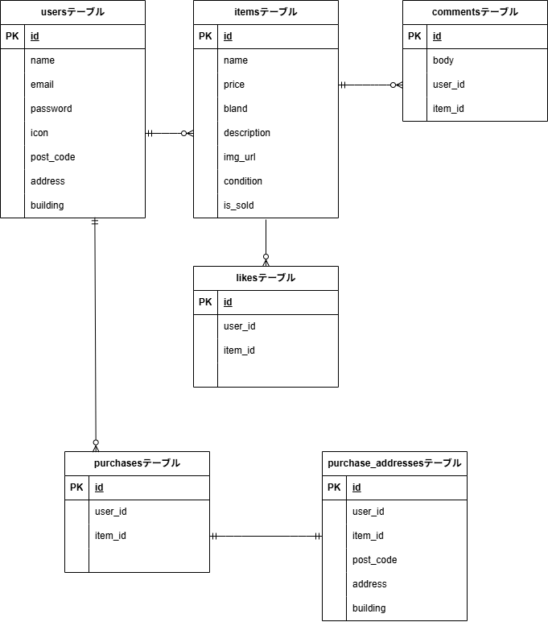

# fleamarket-application(フリマアプリ)

## 環境構築

**Docker ビルド**

1. `git clone git@github.com:KOTOHA240/fleamarket-application.git`
2. DockerDesktop アプリを立ち上げる
3. `docker-compose up -d --build`

**Laravel 環境構築**

1. `docker-compose exec php bash`
2. `composer install`
3. 「.env.example」ファイルを 「.env」ファイルに命名を変更。または、新しく.env ファイルを作成
4. .env に以下の環境変数を追加

```text
DB_CONNECTION=mysql
DB_HOST=mysql
DB_PORT=3306
DB_DATABASE=laravel_db
DB_USERNAME=laravel_user
DB_PASSWORD=laravel_pass
```

5. アプリケーションキーの作成

```bash
php artisan key:generate
```

6. マイグレーションの実行

```bash
php artisan migrate
```

7. シーディングの実行

```bash
php artisan db:seed
```

8. ストレージリンクの作成(画像表示に必要)

```bash
php artisan storage:link
```

## メール認証

mailhogを使用しています。
localhost:8025 にアクセスして認証メールを確認します。

## 使用技術

- PHP8.2.29
- Laravel8.83.29
- MySQL8.0.26

## ER 図



## テストアカウント

- **出品者A**  
  - email: sellerA@example.com  
  - password: password  

- **出品者B**  
  - email: sellerB@example.com  
  - password: password  

- **ダミーユーザーC**  
  - email: userC@example.com  
  - password: password  

## URL

- 開発環境：http://localhost/
- ユーザーログイン: http://localhost/login
- phpMyAdmin:：http://localhost:8080/

## 注意事項

- Dockerコンテナ起動後、必ず`composer install`を実行してください
- 初回起動後は`php artisan migrate --seed`を実行してください
- `.env`ファイルが存在しない場合、`.env.example`をコピーして作成してください